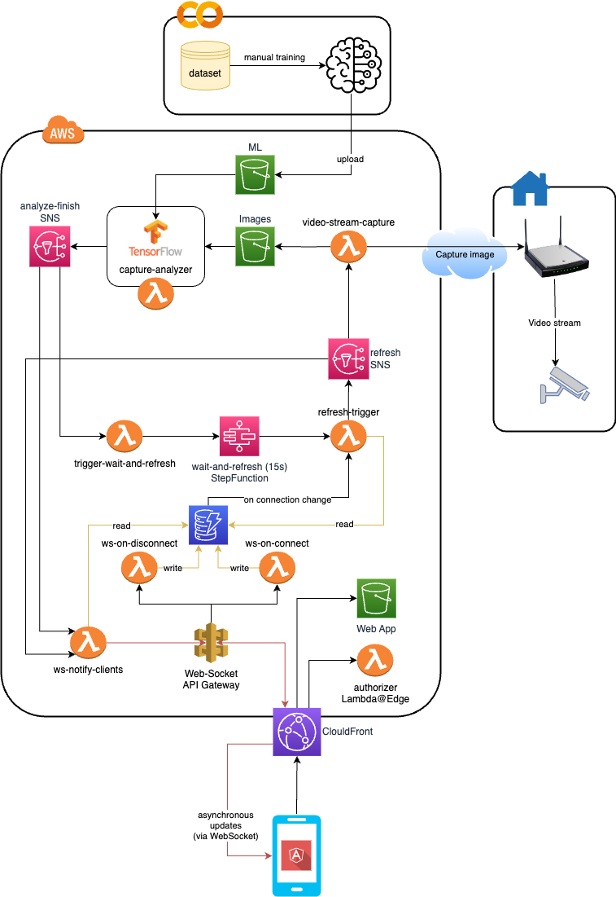

# Parking Status Application
This is a personal project that solves a specific problem that my family had.

## Motivation

### The problem
My family lives in an apartment building. Sadly, we do not own a reserved parking spot. There are 3 shared parking spots for all the building residents are entitled to park there. In addition, there are additional parking spots on the main street which everyone is entitled to park (some closer, and some farther).

Since we own a car, everytime that we get back home we struggle to find where to park our car. The preferred one is inside the building, otherwise the closest parking slot on the street itself.

We wanted a tool that would let us know in advance whether there is an available parking slot. This insight would help us let us take a decision where to park our car. 

### About this project
This project purpose is to solve the above problem.

The application is:
* Hosted on **AWS**.
* Completely a **serverless** solution.
* Code is deployed using **terraform**.
* Machine learning model is trained using **Tensorflow** and inference is done using **Tensorflow Lite**.

## Application

### Architecture diagram


### Components

The **machine learning** model - see more information [here](machine-learning/README.md)  

The **frontend** side is an Angular single-page-application.

The **backend** side using lambda, and it's event-driven. It has 2 parts:
* Client connection handling - using **WebSocket API Gateway** (connections are persisted to **DynamoDB**).
* Business logic - while there are connected clients do the following in loop:
  1. Capture a screenshot from the camera.
  2. Analyze the screenshot using the ML model.
  3. Send the results to connected clients.
  4. Sleep 15 seconds before next update.

### Communication

The API between the **frontend** and the **backend** is using WebSockets:
1. The client open a WebSocket connection, and just wait for updates.
2. The backend pushes 2 types of messages to the clients: **loading** event and **update** event. 

# Development

## Setup environment
* Clone the repository
* Install git hooks
  ```
  git config --local core.hooksPath .githooks/
  ```