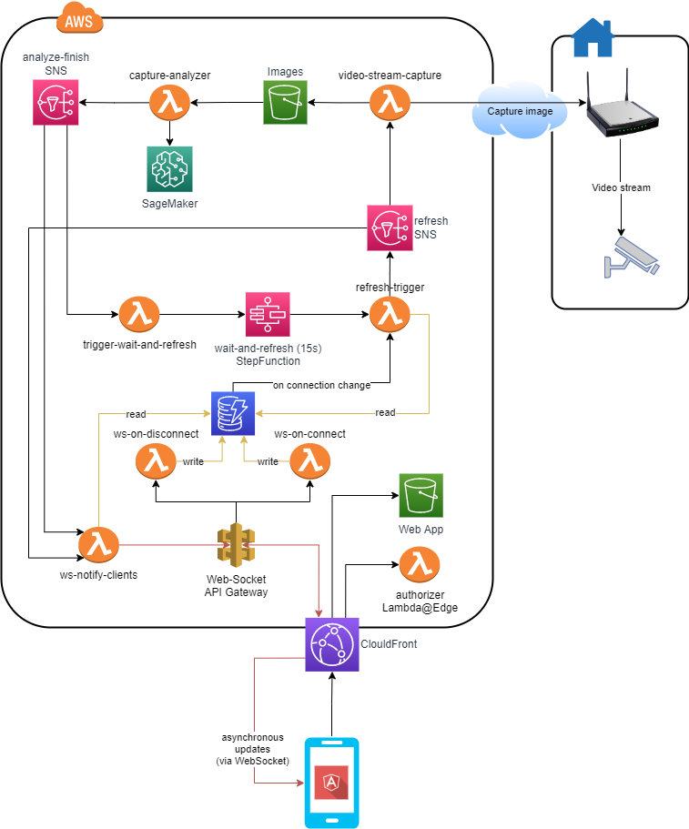

# Parking Status Application
This is a personal project that solves a specific problem that my family had.

## Motivation

### The problem
My family lives in an apartment building. Sadly, we do not own a reserved parking spot. There are 3 shared parking spots for all the building residents are entitled to park there. In addition, there are additional parking spots on the main street which everyone is entitled to park (some closer, and some farther).

Since we own a car, everytime that we get back home we struggle to find where to park our car. The preferred one is inside the building, otherwise the closest parking slot on the street itself.

We wanted a tool that would let us know in advance whether there is an available parking slot.

### About this project
This project aims to solve the above problem.

The application is:
* Hosted on **AWS**.
* Completely a **serverless** solution.
* Code is deployed using **terraform**.

## Application

### Architecture

